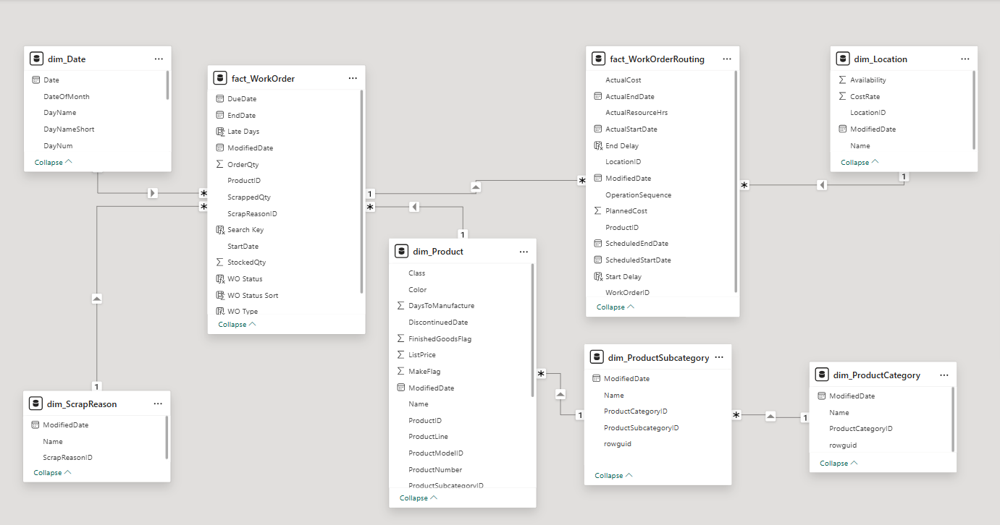
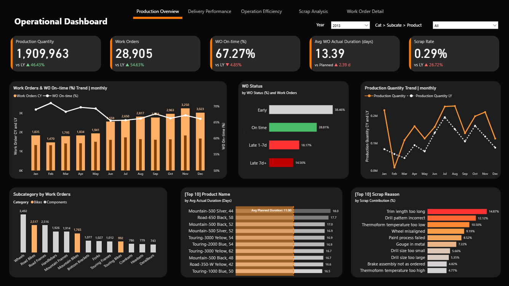
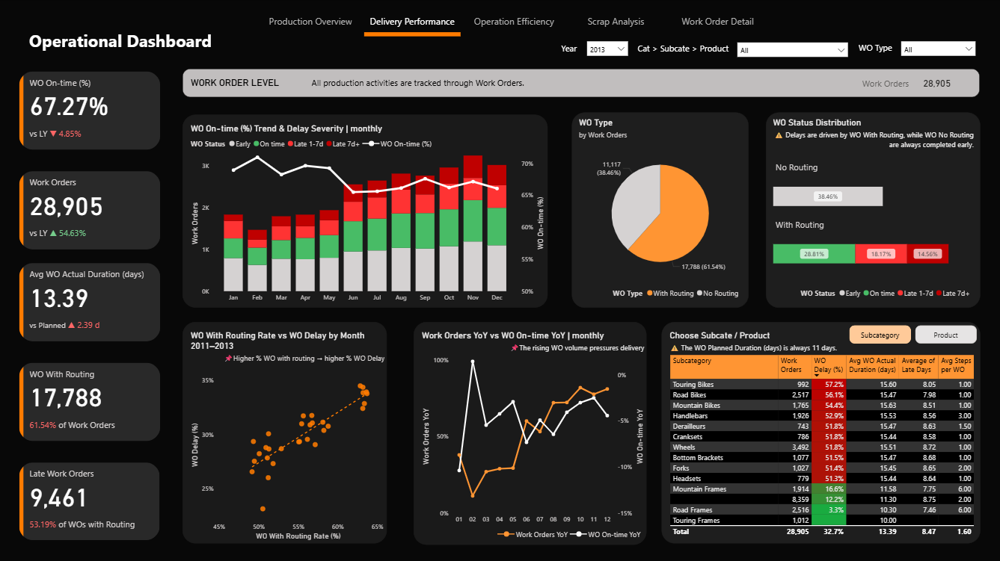
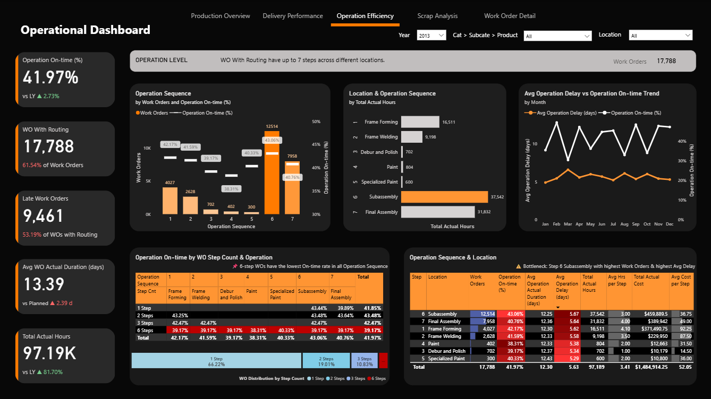
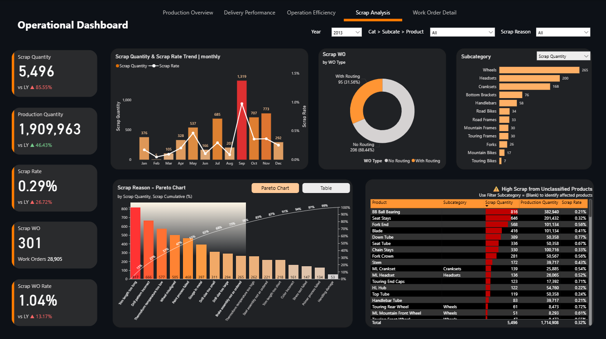
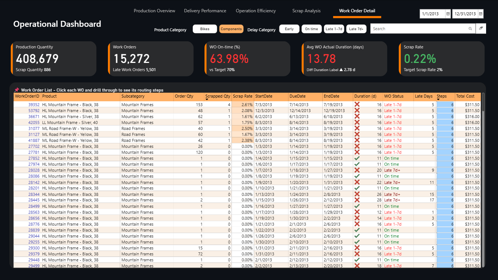
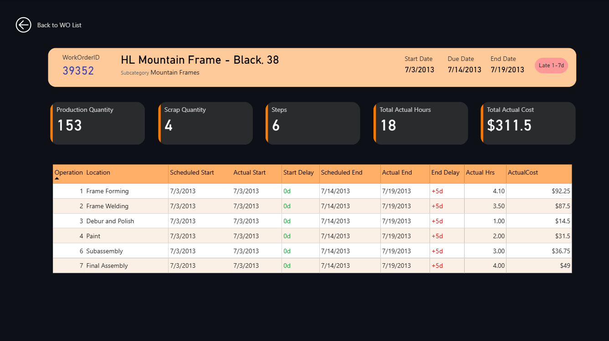

# Identifying Manufacturing Inefficiencies to Improve Operational Efficiency | Power BI

## 📑 Table of Contents  
1. [📌 Background & Overview](#-background--overview)  
2. [📂 Dataset Description & Data Structure](#-dataset-description--data-structure)  
3. [🧠 Design Thinking Process](#-design-thinking-process)  
4. [📊 Key Insights & Visualizations](#-key-insights--visualizations)  
5. [🔎 Final Conclusion & Recommendations](#-final-conclusion--recommendations)

## 📌 Background & Overview  

### What is this project about? 
This project analyzes manufacturing performance in a bicycle production company using Power BI.

🔥 The business is currently facing two major challenges:

- **Production delays:**  The Work Order On-time Rate has been declining over time, while actual production duration consistently exceeds planned schedules.

- **Quality issues:**  Scrap quantity has increased significantly, indicating rework and overload in production process.

🎯 The goal of this analysis is to identify the root causes behind these issues and provide actionable insights to improve operational efficiency.

- Monitor manufacturing performance using key KPIs  

- Diagnose production delays across Work Orders

- Detect bottlenecks and idle time in routing steps

- Analyze scrap trends and detect high-risk products  

- Provide data-driven recommendations to improve planning and execution

### 👤 Who is this project for?  

- Production Directors & CEO 

- Operations Managers & Planners

- Data Analysts in Manufacturing domain

## 📂 Dataset Description & Data Structure  

### Data Source  
- Source: adventureworks2019 in BigQuery
- Size: 71591 rows in Work Order table and 67131 rows in Work Order Routing table

### Data Structure 
- Database Structure: Online Transaction Processing (OLTP) database, showcasing a real-world relational database structure.

- Tables: My project uses 7 tables in Production. Full infomation in data dictionary.

| Table Name                     | Description |
|--------------------------------|-------------|
| Production.Product             | Contains master data for all products manufactured or sold by the company, including product name, color,... |
| Production.ProductCategory     | Defines high-level product categories (e.g., Bikes, Components). |
| Production.ProductSubcategory  | Defines subcategories within each product category (e.g., Mountain Bikes, Road Bikes). |
| Production.WorkOrder           | Records manufacturing orders, including order quantity, start and end dates, and scrapped quantity. |
| Production.WorkOrderRouting    | Details the steps (operations) required for each work order, including location, scheduled hours, and actual costs. |
| Production.Location            | Represents manufacturing and storage locations within the facility. |
| Production.ScrapReason         | Defines the reasons for scrapped items during production. |

### Data Relationships

## 🧠 Design Thinking Process  

1️⃣ Empathize  
2️⃣ Define point of view  
3️⃣ Ideate  
4️⃣ Prototype and review  

Click to toggle

## 📊 Key Insights & Visualizations  

#### I. Production Overview

📌 Key Insights:   

1. KPIs: Production Quantity, Work Orders, WO On-time Rate, Avg WO Actual Duration, Scrap Rate in 2013
- WO On-time Rate is low than target (70%) and is declining over years
- Avg WO Actual Duration is over planned and Planned Duration always 11 days
- Scarp Rate is lower target (0.29% vs 2%) but increasing vs LY 2012
- Production Quantity and Work Orders is increasing
2. Work Orders, WO On-time Rate, Production Quantity Trend | monthly in 2013
- Feb has Work Orders and Production Quantity lowest in year
- WO On-time Rate is highest in Feb, indicating 
3. WO Status Breakdown: Due Date and End Date
- Early (Due Date < End Date) accounts for a large proportion
- On time (Due Date < End Date) -> Ontime rate = Early + Ontime
#### II. Delivery Performance

1. The manufaturing production has 2 Type Work Order: WO with Routing & WO no Routing
-WO with Routing is biggger and cause delays.
-WO no Routing is smaller and always comleted early.
-> Higher % WO with routing -> higher % WO Delay
2. Work Orders YoY vs WO On-time YoY
-  incresing and 
- has the oposite trend in very month
-> The rising WO volume pressure delivery
3. Subcategory/ Product
- Subcategory Touring Frames has WO Ontime rate 100%
- Some products has delays rate 100% -> need focus  
#### III. Operation Efficiency

1. Operation Ontime Rate
- WO with routing has Operation Level. There are 7 Operation (Step) in 7 Location, WO has 1. avg steps
- Operation Ontime Rate is low and lowest in Operation 4, but not a big gap between max min ()
2. Avg Operation Delay & Operation On-time Trend
- fluctuated not much
-
3. Operation On-time by WO Step Count & Operation
- There are 4 Type of WO with routing : 1/2/3/6 steps
- 6 step accounts for the smallest with % but has the lowest Operation On-time rate in all Operation Sequence.
- 1 step accounts for the largest with 66.22% but also has the low Operation On-time, indicating
 
4. Bootleneck: Step 6

#### IV. Scrap Analysis

1. Scrap Quantity and Scrap Rate in 2013
- Scrap Quantity is higher than LY 85.55%, but due to Production Quantity also inscreased 46.43% vs LY
- Scrap Rate is climed 26.72% vs LY -> alert
- Scrap Quantity and Scrap Rate highest in Sep
-> ko phải do overload, vậy do đâu ?
2. WO Scrap
- WO Scrap no routing accounts for larger with 68.44% -> WO no routing done early but higher scrap
3. Scarp Reason
- 80/20
4. Product/ Subcategory Scarp
- High Scarp come from Unclassified Products -> check and fit data
-   
#### V. Work Order Detail

## 🔎 Final Conclusion & Recommendations  

